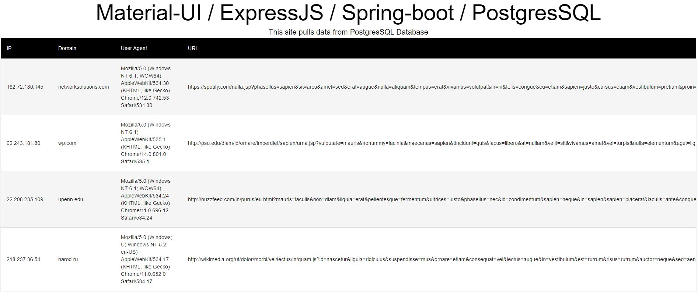

# Data-from-DB
This repo pulls data from DB and puts it into a table

# Technologies
* FrontEnd: Material UI
* EndPoint / Backend: SpringBoot
* Database: PostgreSQL

# Good to know gradle commands
### (``` gradlew tasks --all ```).map(tasks => { ``` gradlew bootRun ``` })

# Look

<p align="center">
  
</p>


