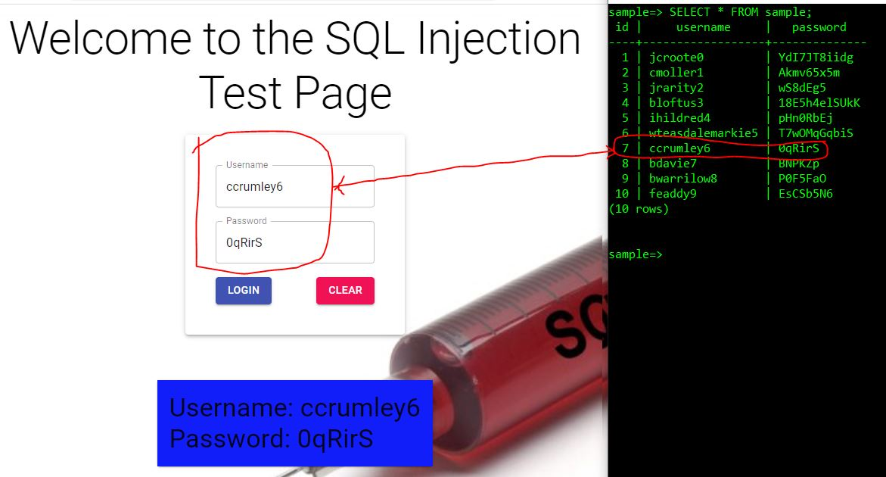
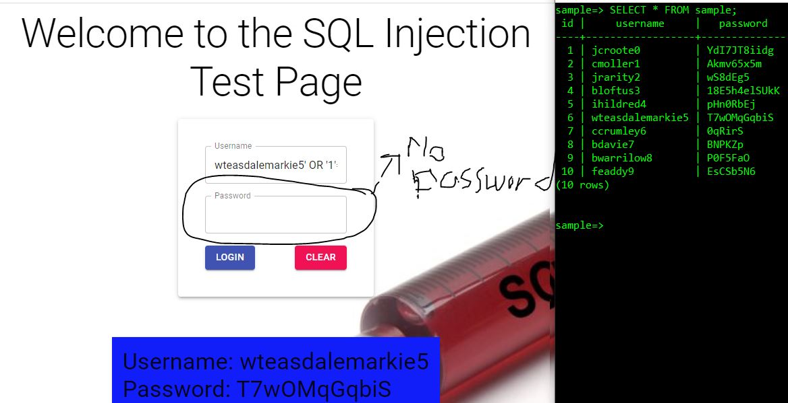
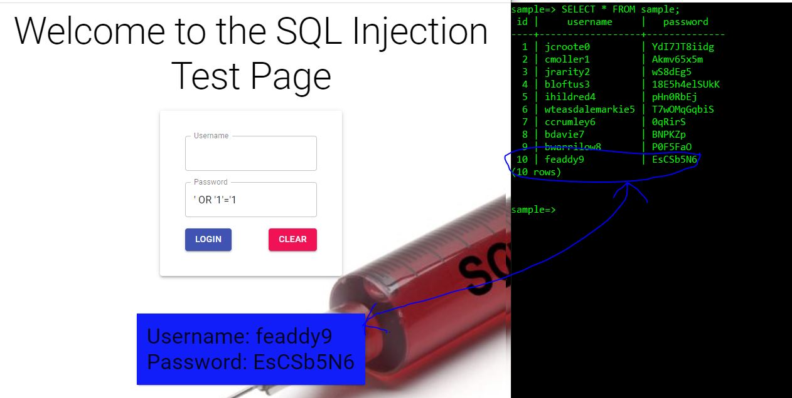

# My First Ever Cyber / Coding Project

## Technologies
- FrontEnd: MaterialUI
- Endpoint: Spring Boot with JPA, Web and Postgres dependencies
- Backend: Postfgres

## Synopsis:
This project was meant to test 2 types of SQL injection commands 

## Walkthrough

#### Validates a user

<p align="center">
  
  
</p>

#### ```validuser' OR '1'='1```

<p align="center">
  
</p>

#### ```' OR '1'='1```
<p align="center">
  
</p>
