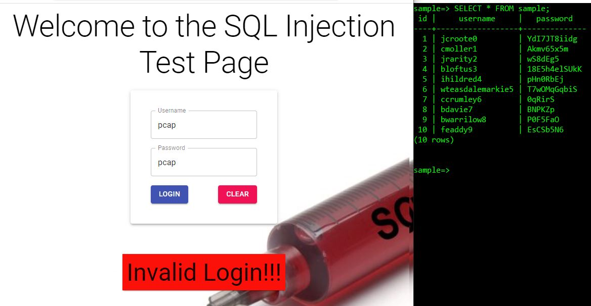

# My First Ever Cyber / Coding Project

## Technologies
- FrontEnd: MaterialUI
- Endpoint: Spring Boot with JPA, Web and Postgres dependencies
- Backend: Postfgres

## Synopsis:
This project was meant to test 2 types of SQL injection commands 

## Walkthrough

#### Validates a user via API call

  

